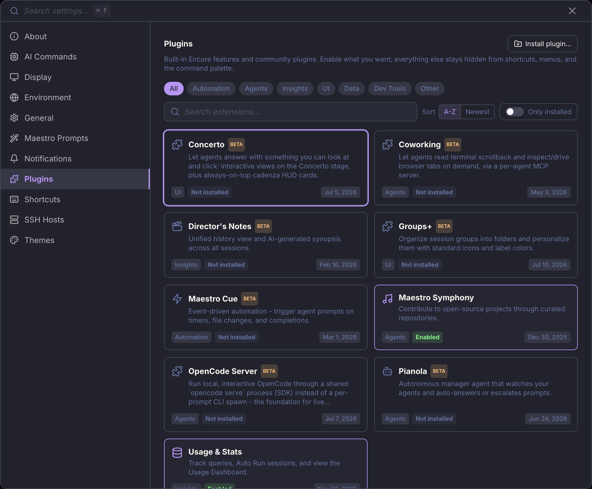
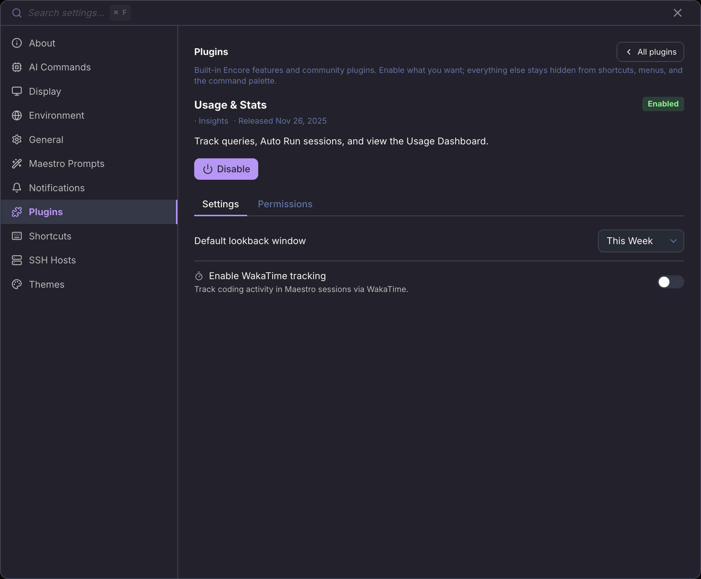

Encore Features are Maestro's system for shipping powerful capabilities that aren't essential for every user. A feature that is off is completely invisible - no shortcuts, no menu items, no command palette entries - which keeps the core app lean while letting power users opt into advanced workflows. Usage & Stats, Director's Notes, Maestro Cue, and Maestro Symphony start on; the rest start off.

They are now managed as **plugins**. Every Encore Feature ships as a built-in ("first-party") plugin, listed in the same catalog as community plugins and turned on the same way. What changed is the plumbing and the settings screen, not the idea: a feature you have not enabled still adds nothing to your keyboard, your menus, or your palette.

## Enabling a feature

Open **Settings** (`Cmd+,` / `Ctrl+,`) and go to the **Plugins** tab. Every built-in feature is listed there as a card with its category, its release date, and whether it is currently enabled.

Click a card to open its detail view, then use the **Enable** / **Disable** button. Features that carry their own options show them on a **Settings** tab beneath that button, and the capabilities the feature is allowed to use are itemized under **Permissions**.

Narrow the catalog with the chips (**Encore**, then Automation, Agents, Insights, UI, Data, Dev Tools, Other), the search box, or the **Only installed** toggle. **Sort** switches between A-Z and newest-first.

### Encore vs Beta

A built-in card carries one of two badges, and the badge says where the feature is in its life:

| Badge      | Meaning                                                                                  |
| ---------- | ---------------------------------------------------------------------------------------- |
| **Encore** | Graduated. It ships enabled, and you turn it off if you do not want it.                  |
| **Beta**   | Still proving itself. It is bundled but starts off, so nothing appears until you opt in. |

**Encore** is not a category, so it sits before them in the chip row rather than among them: a graduated feature still belongs to Automation or Insights, and the chip cuts across all of them to answer "what ships on?" in one click. Community plugins are never Encore; one shows a Beta badge only when its own manifest declares it.

<Note>
Built-in features work with the community plugin subsystem switched off - that is the default, and the banner at the top of the tab says so. **Enable plugins** turns on loading of third-party plugins as well. You do not need it to use anything below.
</Note>

## Available features

| Feature                              | Category   | Shortcut                       | Description                                                                                                                           |
| ------------------------------------ | ---------- | ------------------------------ | ------------------------------------------------------------------------------------------------------------------------------------- |
| [Usage & Stats](./usage-dashboard)   | Insights   | `Opt+Cmd+U` / `Alt+Ctrl+U`     | Records query and Auto Run activity, and unlocks the Usage Dashboard that reports on it                                               |
| [Director's Notes](./director-notes) | Insights   | `Cmd+Shift+O` / `Ctrl+Shift+O` | Unified timeline of all agent activity with AI-generated synopses                                                                     |
| [Maestro Cue](./maestro-cue)         | Automation | `Opt+Q` / `Alt+Q`              | Event-driven automation: file changes, timers, agent chaining, GitHub polling, and task tracking                                      |
| [Concerto](./concerto)               | UI         | `Opt+Cmd+C` / `Alt+Ctrl+C`     | Agents answer with something you can look at and click: interactive views on the Concerto stage, plus always-on-top Cadenza HUD cards |
| [Maestro Symphony](./symphony)       | Agents     | `Opt+Cmd+Y` / `Alt+Ctrl+Y`     | Contribute to open source by donating AI tokens                                                                                       |
| [Groups+](./general-usage#groups)    | UI         | -                              | Organize agent groups into folders, and personalize them with icons and label colors                                                  |
| Pianola                              | Agents     | -                              | An autonomous manager agent that watches your other agents and answers or escalates their prompts                                     |
| Coworking                            | Agents     | -                              | Lets an agent read terminal scrollback and inspect or drive browser tabs, through a per-agent MCP server                              |
| OpenCode Server                      | Agents     | -                              | Runs local OpenCode through a shared `opencode serve` process instead of spawning the CLI per prompt                                  |

Features without a shortcut are not opened from the keyboard: they change how something you already use behaves, rather than putting a new surface on screen.

<Note>
Disabling a feature hides its surfaces; it does not delete what you already have. Turning Groups+ off, for example, collapses your group folders back to a flat list and stops drawing the icons and colors, but the nesting and appearance you set are still stored and come back when you re-enable it.
</Note>

<Warning>
**Usage & Stats is the one to know about.** It is what records the activity every other reporting surface reads. With it off, the Usage Dashboard has nothing to show, and the gap is permanent - Maestro does not backfill activity from a period when recording was disabled.
</Warning>

## For Developers

Want to build a new Encore Feature? The architecture is designed for easy extension - add a flag, wire up the toggle, gate the access points, and your feature ships behind a clean opt-in. Ship it off by default while it proves itself; flip its entry in `DEFAULT_ENCORE_FEATURES` (`src/shared/encoreFeatures.ts`) when it graduates.

See the [Encore Features contributor guide](https://github.com/RunMaestro/Maestro/blob/main/CONTRIBUTING.md#encore-features-feature-gating) for the full implementation checklist, architecture details, and the canonical reference implementation (Director's Notes).
