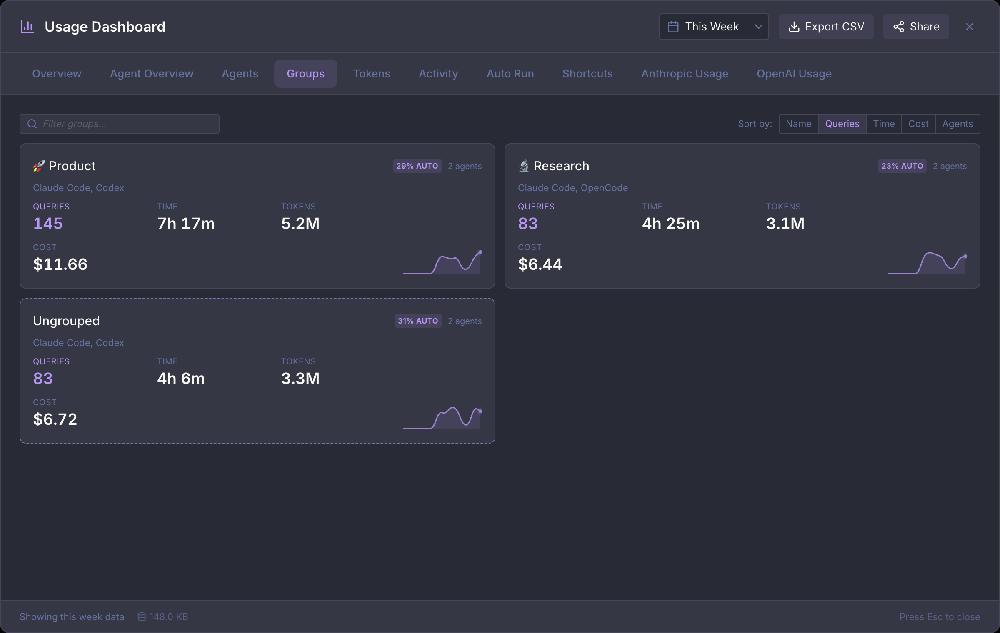

The Usage Dashboard provides comprehensive analytics for tracking your AI usage patterns across all sessions. View aggregated statistics, compare agent performance, and explore activity patterns over time.

<Note>
The Usage Dashboard only tracks activity from within Maestro. It does not include historical data from before you started using Maestro, nor does it capture usage from agents run outside of Maestro (e.g., directly from the command line).
</Note>

## Opening the Dashboard

**Keyboard shortcut:**

- macOS: `Opt+Cmd+U`
- Windows/Linux: `Alt+Ctrl+U`

**From the menu:**

1. Click the hamburger menu (☰) in the top-left corner
2. Select **Usage Dashboard**

**From Quick Actions:**

- Press `Cmd+K` / `Ctrl+K` and search for "Usage Dashboard"

## Dashboard Tabs

The dashboard is organized into tabs, each providing different insights into your usage.

**Overview**, **Agent Overview**, **Agents**, **Groups**, **Tokens**, **Activity**, **Auto Run**, and **Shortcuts** are always present. Three more appear only when there is something for them to show:

| Tab                 | Appears when                                                    |
| ------------------- | --------------------------------------------------------------- |
| **Cue**             | [Maestro Cue](./maestro-cue) is enabled alongside Usage & Stats |
| **Anthropic Usage** | at least one Claude account has reported plan quota details     |
| **OpenAI Usage**    | at least one Codex account has reported plan quota details      |

The per-provider quota tabs read what the provider reports about your plan window, so an account authenticated with an API key rather than a plan login never produces one.

### Overview

The Overview tab gives you a high-level summary of your AI usage:

**Summary Cards:**

- **Sessions** - Total number of registered sessions
- **Total Queries** - Number of messages sent to AI agents
- **Total Time** - Cumulative time spent waiting for AI responses
- **Avg Duration** - Average response time per query
- **Top Agent** - Your most-used AI agent
- **Interactive vs Auto** - How the selected range's AI time divides between work you waited on and work that ran without you, with a split bar underneath

**Delegation Score:**

One number for how much of your AI work runs without you. Auto Run documents and Maestro Cue pipelines count as delegated; a turn you typed and waited on does not. It is a share of **time**, not of turns, because an Auto Run batch is a handful of long turns while an afternoon of chat is hundreds of short ones.

The track has milestones at 25%, 50%, 75%, and 100%:

- The **fill** runs to the highest milestone you have ever unlocked, and stays there. A stretch of hands-on work cannot take back a milestone you earned.
- The **marker** is your live score, which moves in both directions.

Under the track, Maestro names the next milestone and how much more delegated time would reach it. Unlike the other Overview cards, this one covers all retained history rather than the selected time range, so switching the range dropdown does not move it.

<Note>
The two stats systems keep different amounts of history. Query events (interactive and Auto Run) are never pruned, so they go back to your install. Cue **run rows** are pruned after 7 days, so the score takes its Cue time from the same lifetime counter the About card's **Cue Time** tile shows, which survives that prune. Cue counts only runs that finished naturally, matching how Conductor time is credited.
</Note>

**Agent Comparison:**
A horizontal bar chart showing usage distribution across your AI agents. See at a glance which agents you use most, with query counts and time spent per agent.

**Source Distribution:**
A donut chart breaking down your queries by source:

- **Interactive** - Manual queries from AI Terminal conversations
- **Auto Run** - Automated queries from playbook execution

Toggle between **Count** (number of queries) and **Duration** (time spent) views.

**Location Distribution:**
A donut chart showing the breakdown between local and remote (SSH) queries. Useful for understanding how much work is done locally versus on remote machines.

**Peak Hours:**
A 24-hour bar chart showing when you're most active. Each bar represents an hour of the day (0-23), with height indicating query count or duration. The peak hour is highlighted. Toggle between Count and Duration views.

**Activity Heatmap:**
A GitHub-style heatmap showing your activity patterns throughout the week. Each cell represents an hour of the day, with color intensity indicating activity level. Toggle between Count and Duration views to see different perspectives.

**Duration Trends:**
A line chart showing how your query durations vary over time. Useful for spotting performance trends or changes in workload.

### Agent Overview

A compact card per active agent, sized for scanning the whole fleet in one screen rather than studying any one of them. Each card carries the agent name, a live status dot, its query count, and a 7-day activity sparkline. Worktree agents render with a dashed accent border, a **WT** badge, and their checked-out branch, so a parent and its worktrees are distinguishable at a glance. Internal terminal sessions are left out.

A fuzzy filter above the grid narrows the cards live as you type, matching on the agent name (with or without its leading emoji) and on a worktree's branch name.

<Tip>
Agent Overview and **Agents** answer different questions. Agent Overview is the wide, shallow view - who is busy right now. Agents is the deep one, with per-agent stats, sorting, and a drill-down into individual tabs.
</Tip>

### Groups

One tile per Left Bar group, rolling every member agent's activity into a single set of numbers. Bundle a client's agents into a group and this tab answers what that client cost.

Each tile shows the group's emoji and name, the providers its members run on, an **AUTO** badge for the delegated share, the member count, and four measures: **Queries**, **Time**, **Tokens**, and **Cost**, over a sparkline of the selected range.

- **Filter groups** narrows the tiles by name.
- **Sort by** orders them by Name, Queries, Time, Cost, or Agents.
- Clicking a tile opens a per-group detail view: a sortable table of the member agents, showing the same measures the group total was summed from, so a row and the header always reconcile. Clicking a row opens that agent's own detail view on top.

Agents filed under no group are collected into a synthetic **Ungrouped** tile, drawn with a dashed border, rather than being dropped - so the tiles still add up to the totals the rest of the dashboard reports. Empty groups are omitted.

<Note>
Cost and tokens only exist for turns recorded after the stats database began storing them, so a long-lived install shows older activity with query and time figures but no spend.
</Note>

### Agents

The Agents tab shows one card per agent, so you can scan your whole fleet at once. Each card carries the agent name, a live status dot, its age, and three stats: **Queries**, **Tabs**, and **Auto %** (the share of that agent's queries that came from Auto Run or Cue), plus a 7-day activity sparkline. Worktree agents render with a dashed border, a **WT** badge, and their checked-out branch.

**Filtering:** the filter box above the grid narrows the cards as you type. Matching is fuzzy, so `cbst` finds "Cyber Stocks", and it searches the agent name (with or without its leading emoji) as well as a worktree's branch name. A count next to the box shows how many of your agents match. Press `Esc` or click the **ESC** pill to clear the filter; clearing it is what `Esc` does first, so the dashboard stays open.

**Provider accounts:** when your agents are split across more than one provider account, an **All providers** dropdown appears beside the filter box, listing each account with the number of agents behind it (`Claude Code - smash (7)`, `Codex - Default account (3)`, `OpenCode (2)`). Pick one to narrow the grid to those agents. Every card is also badged with its account name, so you can read the split without touching the filter. A plain `~/.claude` or `~/.codex` has no name of its own, so those cards badge the provider instead (`CLAUDE CODE DEFAULT`, `CODEX DEFAULT`) rather than a bare "default account" that would read the same on both. An account is whichever `CLAUDE_CONFIG_DIR` or `CODEX_HOME` that agent runs against; providers that keep one credential store show up as a single entry named after the provider.

The **N agents** chip on each row of the Anthropic Usage and OpenAI Usage tabs is a shortcut into this: click it and Maestro opens the Agents tab already narrowed to that account, so you can see which agents are burning the plan you are looking at. Agents that run over SSH are marked **remote**: on the remote host that directory holds the host's own login, which can be a different account from the one the row measures. A row the last refresh could not update shows a **stale** chip with the time its bars were read.

**Sorting:** the **Sort by** control orders the grid by Name, Created, Recent, Queries, Tabs, Auto %, or Provider (which groups the fleet one account at a time). The stat being sorted on is highlighted on every card, so it is obvious what the order means. **Recent** ranks by when each agent last ran a query, so the fleet reads newest-work-first; under it the card's corner badge switches from the agent's age to that last-query time, and an agent that has not run anything in the selected range drops to the bottom with no badge at all. When a filter is active, the default Name sort ranks the best match first; any other sort keeps the order you chose.

**Tile size:** `+` and `-` resize the tiles, and `0` returns them to the default. The buttons beside the **Sort by** control do the same. A wider tile shows more of a long agent name before it truncates; a narrower one fits more agents on screen at once. Maestro remembers the size you picked, and the Groups tab keeps its own separate size.

**Per-agent details:** click any card to open a detail view for that agent, covering total queries, total and average duration, active days, a full-window daily activity chart, duration distribution (min / median / p95 / max), the user-vs-auto query split, and Auto Run totals.

Two actions in the detail view's header take you out of the numbers and onto the agent itself:

- **Jump to Agent** switches to that agent and lands on its AI transcript, even if you last left it on a terminal, file, or browser tab, and expands whichever Left Bar section it is hiding in.
- **Agent Settings** opens the Edit Agent dialog for it.

Both close the dashboard on the way, since it covers the whole window and you would otherwise land behind it. Stats outlive the agents that produced them, so an agent you have since deleted still has a card here: **Jump to Agent** tells you it is gone rather than appearing to do nothing.

#### Tab breakdown

The detail view also breaks the agent's activity down by AI tab, as a grid of tab tiles. Each tile shows the tab name, **Queries**, **Time** (total agent time in that tab, with the per-query average on hover), **Auto %**, when it was last active, and a 14-day sparkline. The tab currently in focus is badged **Active**, snoozed tabs are badged **Snoozed**, and closed tabs render with a dashed border.

- **Show** picks how far back to look: **Open** (the default, tabs currently open on that agent), **Last 10**, **Last 25**, or **All**.
- **Sort by** orders the tiles by Recent, Queries, Time, or Name.

**Paging:** an agent with a long history can have hundreds or thousands of tabs, so **All** is shown 32 tiles at a time. Page arrows appear next to the tile count whenever the list overflows one page, and you can also page with the Left and Right arrow keys once they have focus. The narrower filters always fit on a single page, so the arrows only show up when they are actually needed. Changing the filter or the sort returns you to the first page.

The detail view is resizable: drag any edge or corner to resize it, and double-click a resize handle to return to the default size. Maestro remembers the size you chose and reuses it the next time you open an agent's details.

<Note>
Maestro records which tab issued each query, but tab *names* live with the tab itself. A tab that is open, snoozed, or was closed during this app session is shown by name; older closed tabs can only be identified by a short ID (e.g. `DEADBEEF`). This is why **Open** is the default view - a long-running agent accumulates many retired tabs that can no longer be named.
</Note>

### Tokens

Token and cost consumption, broken down by agent, model, provider account, and time.

This tab has a different data source from the rest of the dashboard. Where the other tabs read Maestro's own record of what it ran, Tokens reads each agent's on-disk transcripts, which is where the provider writes the token counts it actually billed.

Two things it is careful about:

- **Estimated versus reported cost.** Only some agents report a real cost figure. Everything else is priced from a built-in rate table, and those numbers are marked with a `~` and explained in a footnote, so an estimate is never presented as authoritative.
- **Multiple provider accounts.** Running several accounts from separate provider homes is common, and the **Accounts** breakdown reports each one's spend separately rather than blending or dropping them. Each row names its provider as well as its account (`Claude Code - Default account`, `Codex - project-acc-1`), so two providers' default accounts can never land in one row. Hover a row to see the account's full directory.

  Which providers can split by account depends on whether the provider's CLI ships a variable that selects its home directory:

  | Provider      | Variable            | Default directory         |
  | ------------- | ------------------- | ------------------------- |
  | Claude Code   | `CLAUDE_CONFIG_DIR` | `~/.claude`               |
  | Codex         | `CODEX_HOME`        | `~/.codex`                |
  | Copilot-CLI   | `COPILOT_HOME`      | `~/.copilot`              |
  | OpenCode      | none                | `~/.local/share/opencode` |
  | Factory Droid | none                | `~/.factory`              |

  OpenCode and Factory Droid ship no per-account home variable, so their spend is reported under a single row per provider. Maestro finds an account from the variable set on an agent (or on the provider, in Settings), from your own shell environment, and from `~/.<provider>-*` directories on disk. Accounts that share one transcript directory by symlink are counted once, not once per account.

  A home is not always a login. `COPILOT_HOME` relocates Copilot CLI's transcripts but leaves its login machine-wide, so two Copilot homes report as two rows that bill one GitHub account. [Multiple Accounts](/multi-provider) covers what each provider's variable does and does not move.

  SSH-remote agents are not attributed by account: their transcripts live on the remote host.

Every chart on the dashboard also gains a **Tokens** metric mode, so charts that would otherwise plot query counts or time can plot token consumption over the same range.

### OpenAI Usage

One row per Codex account (`CODEX_HOME`), each with its plan badge, its email, and a bar per usage window: **Session (5h)**, **Weekly**, and any per-model limits the account reports, every one labelled with when it reopens.

#### Usage resets

OpenAI grants Codex accounts occasional **reset credits**. Redeeming one reopens that account's consumed usage windows straight away instead of waiting for the clock. Codex only exposes this inside its own terminal UI, so Maestro surfaces it here: any account holding credits grows a **Usage resets** block under its bars, listing each credit with its expiry and a **Reset now** button.

Redeeming always asks first, because the credits are finite, expire (typically about a month after they are granted), and cannot be refunded. Maestro spends the soonest-to-expire credit so none lapses while others sit unused, and re-reads your usage immediately afterwards, so the bars show the reopened windows rather than the exhausted ones you just paid to clear.

<Warning>
A reset credit reopens whatever is currently consumed. Redeem one while your windows are near-empty and it is simply gone, having reset nothing. Maestro reads this from the account (the header says `2 available - 0 would take effect now`) and says so in the confirmation, but it will not stop you: they are your credits.
</Warning>

An account with no credits shows no block at all, so the row stays as it was.

#### Automatic resets

Individual agents can redeem a credit on their own when they hit a wall. The toggle is in the agent's **Codex Settings**, directly under Reasoning Effort, in both the New Agent and Edit Agent dialogs:

**Redeem a reset credit when this agent hits its usage limit** - off by default.

Turned on, an agent that stops on a plan-quota limit spends one credit and lets its usual auto-retry pick the work back up once the window is open. Maestro will not do this quietly: every automatic redemption raises a notification naming the agent and how many windows reopened.

The automation is deliberately more cautious than the button:

| It fires only when                               | Because                                                                               |
| ------------------------------------------------ | ------------------------------------------------------------------------------------- |
| The agent runs on Codex and the toggle is on     | No other provider has reset credits, and the default is off                           |
| The stop is a real plan-quota limit              | A crash or an auth failure is not something a reset can fix                           |
| The account confirms the reset would take effect | It refuses a spend that would reset nothing, and refuses when it cannot tell          |
| It has not already reset for this outage         | One wall must not be able to walk through the whole balance one error at a time       |
| The agent runs locally                           | Over SSH the credits read here belong to this machine, not to the host the agent uses |

Turn it off and nothing changes about the manual button: the credits stay yours to spend from the dashboard whenever you choose.

### Shortcuts

How much of the keyboard you actually use, from two sources: which shortcuts you have ever fired, and how often shortcuts fired per day.

The mastery figure counts only shortcuts that have a key bound to them. An action with no chord assigned cannot be fired, so it is excluded from both the total and the "unused" list - listing one would send you off to press a chord that does not exist. The same numbers drive the mastery bar in the keyboard shortcuts help modal, so the two can never disagree.

The **Unused Shortcuts** list is the useful half: bound chords you have never pressed, which is the shortest path to getting faster.

### Activity

The Activity tab shows your usage patterns over time:

- **Interactive vs Delegated** - stacked bars, one per day, splitting each day into interactive work and delegated work (Auto Run + Cue). Toggle between **Time** and **Queries**; hovering a bar breaks the day out into Interactive, Auto Run, and Cue, with that day's delegated share. On a long range the bars are grouped into equal blocks of days so the chart stays readable, and quiet days are drawn as gaps rather than skipped. Because Cue run rows are pruned after 7 days, ranges longer than a week show Auto Run only for the older days, and the chart says so under the legend
- Duration trends chart showing how your usage varies
- Time-based filtering to spot patterns
- Useful for understanding your productivity cycles

### Auto Run

The Auto Run tab focuses specifically on automated playbook execution:

**Metric Cards:**

- **Total Sessions** - Number of Auto Run sessions
- **Tasks Done** - Total tasks completed (with attempted count)
- **Avg Tasks/Session** - Average tasks completed per Auto Run session
- **Success Rate** - Percentage of tasks that completed successfully
- **Avg Session** - Average duration of an Auto Run session
- **Avg Task** - Average duration per individual task

**Tasks Completed Over Time:**
A mini bar chart showing task completions by date (last 14 days). Hover over bars to see exact counts and success percentages for each day.

**How a run's duration is measured:** wall-clock time from start to finish, minus any time the machine spent asleep. Whether the Maestro window was on screen makes no difference - the agent runs in its own process and keeps working while you do something else, so a run you walked away from is timed the same as one you watched.

Older builds also subtracted time the window was hidden, which on macOS includes being minimized or fully covered by another app. That under-recorded exactly the unattended overnight runs whose length matters most, and recorded some as zero. If your history predates the fix, `scripts/repair-autorun-durations.mjs` rebuilds each affected run's duration from its own task timestamps (dry run by default; `--apply` writes, after a backup). Runs with no recorded tasks cannot be reconstructed and are left as they are.

## Time Range Filtering

Use the time range dropdown in the top-right corner to filter all dashboard data:

| Range          | Description                                |
| -------------- | ------------------------------------------ |
| **Today**      | Current day only                           |
| **This Week**  | Current week (default)                     |
| **This Month** | Current calendar month                     |
| **This Year**  | Current calendar year                      |
| **All Time**   | Everything since you started using Maestro |

The selected time range applies to all tabs and charts. Your preferred time range is saved and restored between sessions.

## Keyboard Navigation

| Shortcut                       | Action                          |
| ------------------------------ | ------------------------------- |
| `Cmd+Shift+[` / `Ctrl+Shift+[` | Previous tab                    |
| `Cmd+Shift+]` / `Ctrl+Shift+]` | Next tab                        |
| `Arrow Up/Down`                | Navigate between chart sections |
| `Home`                         | Jump to first section           |
| `End`                          | Jump to last section            |
| `Esc`                          | Close dashboard                 |

## Exporting Data

Click **Export** in the top-right corner and pick a format. Both cover the selected time range and hold the same data:

| Format   | What you get                                                                                        |
| -------- | --------------------------------------------------------------------------------------------------- |
| **JSON** | One file with every table and the dashboard's computed totals. Best for scripts and `jq`.           |
| **CSV**  | A `.zip` with one CSV per table, plus `export-info.json` holding the totals. Best for spreadsheets. |

The export includes query events (with per-turn tokens and cost), Auto Run sessions and tasks, agent lifecycle, Agent Resilience outages, wizard runs, daily shortcut usage, multi-window usage, token usage by agent, model, project, and account, and Maestro Cue runs when Cue is on. Cue keeps 7 days of run history, so a longer range includes only the last week of Cue runs.

A toast confirms where the file was saved and how many rows it holds.

## Data Collection

### What's Tracked

The Usage Dashboard collects:

- **Query events** - Each message sent to an AI agent, including duration and which agent handled it
- **Auto Run sessions** - Start/end times of automated playbook runs
- **Auto Run tasks** - Individual task completions within playbooks

### What's NOT Tracked

- Message content (your prompts and AI responses)
- File contents or paths
- Token counts or costs (tracked per-session in the main UI, not aggregated in the dashboard)
- Activity outside of Maestro

### Enabling/Disabling Collection

Stats collection is enabled by default. To disable:

1. Open **Settings** (`Cmd+,` / `Ctrl+,`)
2. Go to the **General** tab
3. Find **Usage Dashboard** section (marked with Beta badge)
4. Toggle off **Enable stats collection**

You can also set your **Default dashboard time range** here (Today, This Week, This Month, This Year, or All Time).

Disabling collection stops new data from being recorded but preserves existing data in the dashboard.

## Accessibility

The Usage Dashboard adopts Maestro's colorblind-friendly chart palette (Wong, _Nature Methods_ 2011) when **Color Blind Mode** is enabled in **Settings → Display → Accessibility**. Agent and source distinctions switch to a high-contrast set tested against protanopia, deuteranopia, and tritanopia.

See [Configuration → Accessibility](./configuration#accessibility) for everything the toggle changes across the rest of the app.

## Additional Features

**Real-time Updates:**
The dashboard automatically refreshes when new queries are recorded. An "Updated" indicator briefly appears when new data arrives.

**Database Size:**
The footer displays the current size of the stats database, helping you monitor storage usage over time.

**Footer Summary:**
The middle of the footer states what the tab in front of you is actually
showing, and it changes with the tab: `24 of 84 agents` once you narrow the
Agents grid, `126 runs · 12 pipelines · 8 failed` on Cue, `3 accounts · peak
window 87%` on a plan quota tab. It reflects the filters you set, not just the
time range, so it is the fastest way to confirm a filter is on when the grid
looks emptier than you expected. A tab with nothing to say yet (still loading,
or an empty range) leaves the slot blank rather than showing a row of zeroes.

## Tips

- **Check the Activity Heatmap** to understand your most productive hours
- **Use Peak Hours** to identify your most productive time of day
- **Compare agents** to see if one consistently performs faster than others
- **Monitor Auto Run vs. Interactive** ratio to understand your automation level
- **Export regularly** if you want to track long-term trends externally
- **Use time filtering** to focus on recent activity or see the big picture
